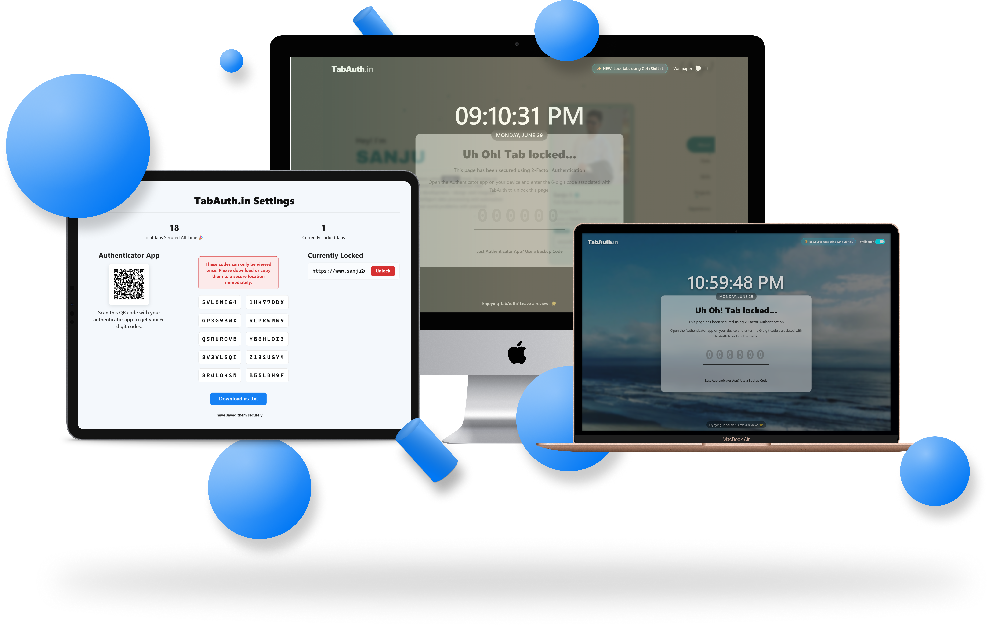
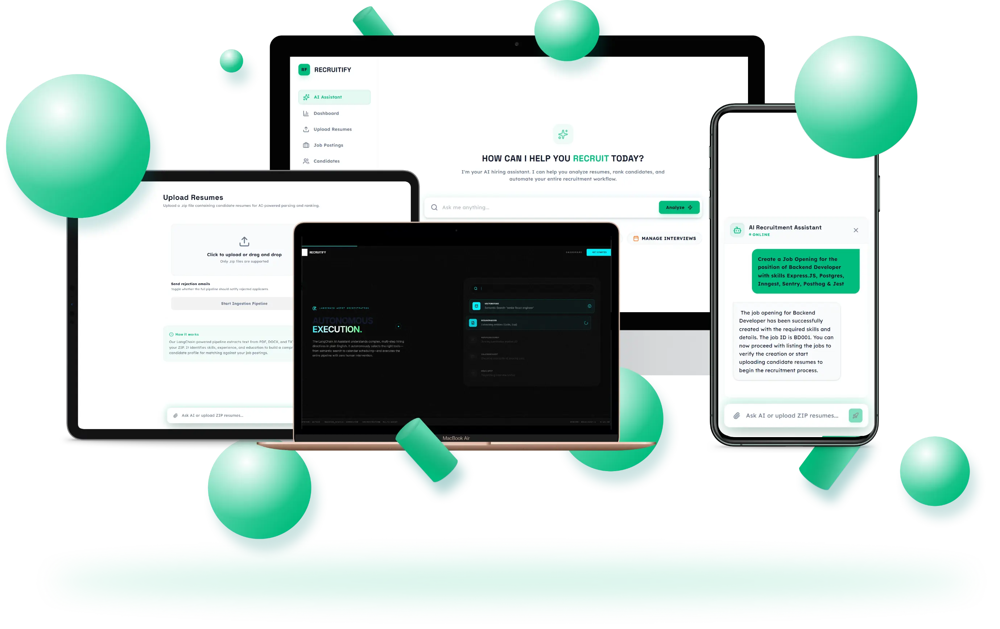
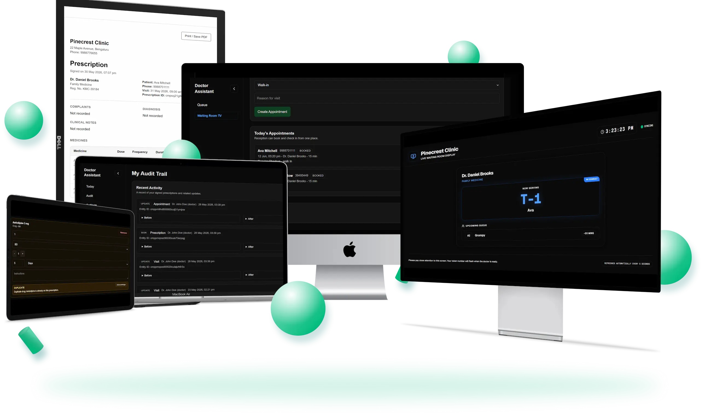
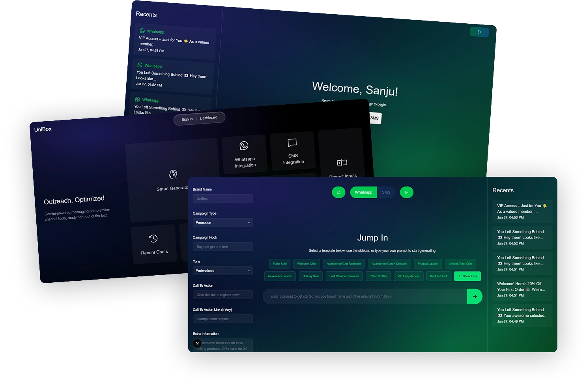

 

  

 

## ⟢ tldr;

I build things end-to-end and own them completely. Solo-founded tabauth.in - the World's first browser extension with 2FA based TOTP tab locking, **featured on the Chrome Web Store**. Currently working directly with clients to ship AI-driven real world products. In between, I've shipped multi-tenant healthcare platforms, AI recruitment engines, and outreach automation - all in production, all with real users.

18 months of hands-on engineering. Zero interest in half-finished side projects.

 

## ⟢ TabAuth.in - *the flagship*
 

<!-- <table>
<tr>
<td width="100%" valign="top" align="center"> -->

<!-- </td>
</tr>
<tr>
<td align="top"> -->

**The world's first browser extension bringing TOTP-based 2FA directly into individual tabs.**

Lock any sensitive tab. Require re-authentication before it reopens. Nothing touches the cloud - auth stays local, by design.

I own this end-to-end: architecture, engineering, Chrome Web Store compliance, deployment, and every line of code shipped since. It's the project I'd point to first if you want to know how I think about a product.

**Featured on the Chrome Web Store** for meeting Google's technical and UX bar.

Available on Chrome, Firefox & Edge

[`Install Now`](https://tabauth.in)
 
 
`HTML` `CSS` `Node.js` `Vite`

<!-- </td>
</tr>
</table> -->

 

## ⟢ Where I'm Building Right Now

 

## ⟢ Selected Work

<table>
<tr>
<td width="33%" valign="top">

<h3>Recruitify</h3>

Multi-agent AI recruitment platform. Fine-tuned BERT hits **98% accuracy** on entity extraction, cutting manual screening by **40%**. RAG-powered assistant orchestrated via LangChain over a vector store.
  
`PyTorch` `Hugging Face` `LangChain` `RAG`

<a href="https://recruitify-mvp.vercel.app/">↗ Live demo</a>

</td>
<td width="33%" valign="top">

<h3>Doctor Assistant</h3>

Multi-tenant clinic platform - booking, live token queues, prescription generation, full audit trail. WhatsApp + Socket.io real-time flow cut patient wait times **35%**.
    
`Next.js` `PostgreSQL` `Prisma` `Redis` `Inngest`

<a href="https://doctor-assistant-mvp.vercel.app/">↗ Live demo</a>

</td>
<td width="33%" valign="top">

<h3>Unified Inbox</h3>

AI outreach platform automating WhatsApp/SMS campaigns. Live dashboard, sub-second data refresh, engagement lift of **45%**.
     
`Next.js` `NextAuth` `Socket.io`

<a href="https://unified-inbox-beta.vercel.app/">↗ Live Demo</a>

</td>
</tr>
</table>
 

**In progress right now:** Contributing to the **Vitalex SDK** for streaming AI observability.

 

## ⟢ Stack

<table>
<tr><td width="18%"><b>Languages & Frameworks</b></td><td>

</td></tr>

<tr><td><b>Databases & Backend</b></td><td>

</td></tr>
<tr><td><b>AI/ML & NLP</b></td><td>

</td></tr>
<tr><td><b>Clouds & DevOps</b></td><td>

</td></tr>
<tr><td><b>Architecture & System Design</b></td><td>

</td></tr>
</table>

 

## ⟢ A Bit More

CSE undergrad at VTU — **9.34 CGPA** — with 18 months of production engineering behind me already. I gravitate toward concurrency, distributed workflows, and multi-tenant systems: the kind of infrastructure problems that don't show up in tutorials.

🏅 Top-50 open-source contributor, OpenCode 2024 &nbsp;·&nbsp; 15+ OSS contributions, OpenCode 2023 &nbsp;·&nbsp; Google Cloud Facilitator Programme

 

### Let's talk

If you're building something that needs to actually work — not just demo well — I'd like to hear about it.

  

